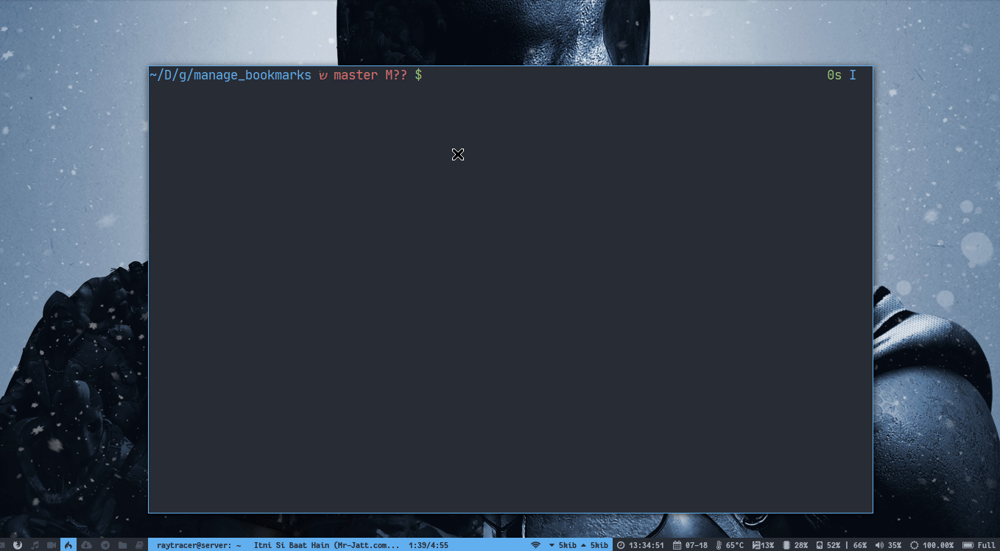

# Manage Bookmarks

A collection of script to dynamically open the bookmarks and manage them.

**Preferred Browser** - [qutebrowser](https://qutebrowser.org/)

Although, this can open the bookmark to any browser but currently it only updates
the global _bookmark_ file with qutebrowser's bookmark file.

If a qutebrowser window is already opened, it attaches the new tab to the window
instead of opening a new window of qutebrowser.

Default, place for global config is `$HOME/.config/bookmarks`

### See the demonstration:

